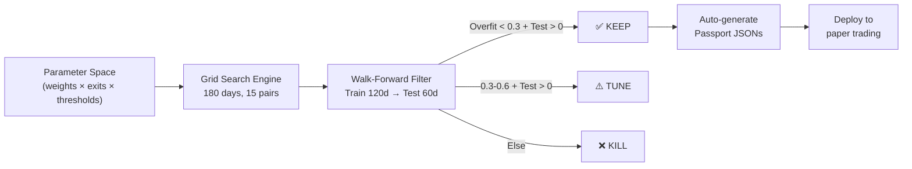

# Strategy Discovery Engine + Persistent State

---

## Feature A: Strategy Discovery Engine

> [!IMPORTANT]  
> **Revised:** Bukan sekedar backtest existing 7 passport. Pipeline ini **menemukan varian baru** via automated combinatorics + walk-forward filtering, lalu auto-generate passport JSON untuk yang lolos.

### Architecture



Discovery backtests bisa diparalelkan lewat `--workers > 1` karena `StrategyDiscoveryEngine` memakai `ProcessPoolExecutor`. Yang masih serial adalah runtime production runner: passport dan symbol dieksekusi berurutan di dalam setiap scan cycle.

### Parameter Search Space

| Dimension | Values | Count |
|-----------|--------|-------|
| Volume Threshold | 1.5, 2.0, 2.5, 3.0 | 4 |
| Confidence Threshold | 50, 54, 60, 65, 70 | 5 |
| Weight Profiles | 5 presets (see below) | 5 |
| Exit Strategy | Fixed%, ATR, Trailing, ATR+Trailing | 4 |
| **Total combinations** | | **400** |

**Weight Profiles:**
1. **Equal** — semua 1.0
2. **Volume-Heavy** — volume 3.0, pressure 2.0, sisanya 1.0
3. **Trend-Purist** — ema 2.0, macd 2.0, candle 1.5, sisanya 0.5
4. **Reversal** — rsi 2.0, bb 2.0, divergence 2.0, ema/macd 0.0
5. **Minimal** — hanya volume + ema + bb (sisanya 0.0)

> 400 combos × ~2 min/backtest = ~13 jam. Bisa chunked overnight.

---

### Task A1: Discovery Engine Core

#### [NEW] [discovery_engine.py](../bot/discovery_engine.py)

```python
class StrategyDiscoveryEngine:
    def __init__(self, symbols, interval, days=180)
    
    def generate_search_space(self) -> list[dict]
        """Generate all parameter combinations."""
    
    def run_discovery(self, max_workers=1) -> list[dict]
        """Run full grid search. Returns sorted results."""
    
    def _backtest_config(self, config_override) -> dict
        """Single backtest run with config. Returns summary + config."""
```

- Reuses `run_backtest()` from [backtester.py](../bot/backtester.py), which calls `backtest_pair()` per symbol and summarizes results via `_summarize()`
- Progress reporting: `[Discovery] 42/400 (10.5%) — Best so far: +67% (Vol2.5, Trend-Purist, ATR+Trail)`
- Saves intermediate results to `discovery_results.json` (crash-safe resume)
- Outputs top 20 results sorted by **Sharpe Ratio** (not just return)

#### [MODIFY] [backtester.py](../bot/backtester.py)

- Add **Sharpe Ratio** and **Calmar Ratio** to `_summarize()`
- Add **Sortino Ratio** (penalizes downside vol only, better for asymmetric strategies)

---

### Task A2: Walk-Forward Validator

#### [NEW] [walk_forward.py](../bot/walk_forward.py)

Takes the top N results from discovery and stress-tests them:

```python
def walk_forward_validate(config_override, symbols, interval, 
                          train_days=120, test_days=60) -> dict:
    """
    Returns:
        train_result: backtest on day 1-120
        test_result:  backtest on day 121-180 (never seen during training)
        overfit_score: |train_sharpe - test_sharpe| / max(abs(train_sharpe), 0.1)
        verdict: KEEP / TUNE / KILL
    """
```

Verdict rules:
- `overfit_score < 0.3` AND `test_return > 0` → ✅ **KEEP**
- `overfit_score 0.3-0.6` AND `test_return > 0` → ⚠️ **TUNE**
- `overfit_score > 0.6` OR `test_return < 0` → ❌ **KILL**

---

### Task A3: Auto-Passport Generator + Report

#### [NEW] [run_discovery.py](../run_discovery.py)

CLI runner:
1. Runs discovery engine (400 combos, ~13 hours overnight)
2. Takes top 20, runs walk-forward validation (~40 min)
3. For each ✅ **KEEP** result → auto-generates passport JSON in `pumpradar-passports/configs/discovered/`
4. Outputs comparison report + sends summary to Telegram

`configs/discovered/` is not auto-loaded by `PassportRunner`. These JSONs must be copied or promoted into top-level `pumpradar-passports/configs/*.json`, or the loader must be changed to recurse into the discovered directory.

Auto-generated passport example:
```json
{
    "name": "Discovery #7 — VolHeavy ATR Trail",
    "emoji": "🔬",
    "description": "Auto-discovered: Vol 2.5, Trend-Purist weights, ATR+Trailing. Sharpe 2.3, WF-validated.",
    "config_overrides": { ... },
    "metadata": {
        "discovered_at": "2026-03-31",
        "train_return": "+67%",
        "test_return": "+41%",
        "overfit_score": 0.22
    }
}
```

---

## Feature B: Persistent State (unchanged)

### Task B1: StateStore Module

#### [NEW] [state_store.py](../bot/state_store.py)

SQLite with 3 tables: `positions`, `equity_snapshots`, `trade_log`.

```python
class StateStore:
    def __init__(self, db_path="state.db")
    def save_position(self, passport_name, signal, equity_at_entry, risk_amount, tg_msg_id=None)
    def update_position(self, pos_id, **kwargs)
    def load_open_positions(self, passport_name=None) -> list[dict]
    def save_equity(self, passport_name, equity)
    def get_last_equity(self, passport_name) -> float
    def log_trade(self, passport_name, trade_data)
    def get_signal_message_id(self, symbol, passport_name) -> int | None
```

`PUMPRADAR_STATE_DB` overrides the DB location; if it is relative, the code resolves it from the repo root. `tg_msg_id` can be inserted as `NULL` and patched later after the Telegram send returns.

### Task B2: Integrate into PassportRunner + Notifier

#### [MODIFY] [passport_runner.py](../bot/passport_runner.py)
- Startup: load open positions + equity from DB
- Disabled passports with existing DB rows are restored for position monitoring, but they are skipped for new scans.
- On signal: `save_position()` before Telegram send, then patch `tg_msg_id` after the message id comes back
- On TP/SL: `update_position()` + `log_trade()` + `save_equity()`

#### [MODIFY] [notifier.py](../bot/notifier.py)
- Startup: restore `signal_message_ids` from DB
- Commands: `/summary`, `/stats`, `/status`, `/ping`

#### Runtime Note
- `bot/main.py` is the legacy stateless single-passport path.
- `bot.main_multi` is the persisted multi-passport production path.
- `reversal.json` in the current tree uses `REVERSAL_MODE=true`, `rsi_divergence=1.0`, and Sideways guardrails. The config stays disabled in production until those guardrails prove safe in fresh forward testing.

---

## Execution Order

| Phase | Task | Effort | Notes |
|-------|------|--------|-------|
| 1 | **B1** — StateStore | ~150 LOC | Foundation, no deps |
| 2 | **B2** — Integrate persistence | ~80 LOC | Immediate value |
| 3 | **A1** — Discovery Engine | ~200 LOC | Can run overnight |
| 4 | **A2** — Walk-Forward Validator | ~120 LOC | Filters overfit |
| 5 | **A3** — Auto-Passport + Report | ~100 LOC | Deploy winners |

## Verification

### Persistent State
- Start → generate signals → kill → restart → verify state restored
- Verify TG reply threading survives restart

### Discovery Engine
- Smoke test: `python3 run_discovery.py --interval=1h --combos=10 --pairs=3 --workers=2 --top-n=5 --train-days=30 --test-days=15` (~5 min)
- Full run: `python3 run_discovery.py --interval=1h --pairs=15 --workers=4 --top-n=20 --train-days=120 --test-days=60` (overnight)
- Check auto-generated passports are valid JSON and loadable by PassportRunner
